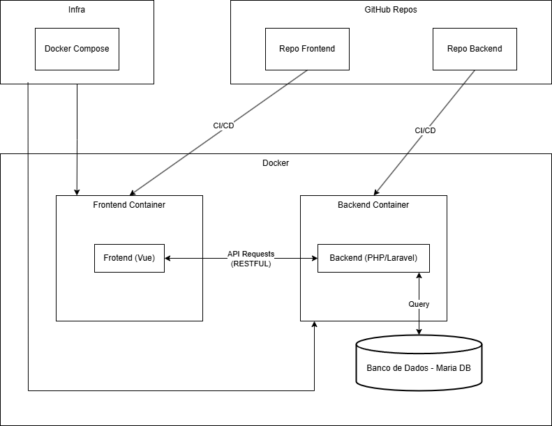

# 🌟 **Documentação do Projeto** 🌟

## 🏗️ **Visão Geral**
Este projeto tem como objetivo fornecer uma plataforma completa para **gerenciamento de notas e tarefas**, **controle financeiro** e **monitoramento de saúde**. A aplicação é construída com uma arquitetura moderna utilizando **Docker, Vue.js (Frontend) e Laravel (Backend)**, com banco de dados **MariaDB**.

## 📜 **Arquitetura do Sistema**
O projeto é composto por **três principais containers** que interagem entre si:

- **Frontend (Vue.js)**
- **Backend (PHP/Laravel)**
- **Banco de Dados (MariaDB)**

O fluxo de integração e deploy é automatizado via **CI/CD** e os serviços são orquestrados utilizando **Docker Compose**.

---

## 🛠️ **Infraestrutura**
A infraestrutura da aplicação é gerenciada da seguinte forma:

- **Repositórios GitHub**
  - `repo-frontend` (Vue.js)
  - `repo-backend` (Laravel/PHP)
- **CI/CD**
  - Automatiza o build e deploy para os containers Docker.
- **Docker Compose**
  - Gerencia os serviços para garantir fácil escalabilidade e deploy.

### 🔧 **Fluxo de Deploy**
1. O código é enviado para os repositórios do GitHub.
2. O CI/CD dispara o build dos containers **Frontend** e **Backend**.
3. Os containers são atualizados automaticamente e se comunicam via **API RESTful**.

---

## 🏛️ **Estrutura de Funcionalidades**
### 🔐 **Autenticação e Conta**
- Cadastro, login e recuperação de senha.
- Atualização de perfil e configurações.
- Confirmação via e-mail e SMS.

### 📝 **Notas e Tarefas**
- Criar, editar e excluir notas.
- Criar, editar e excluir tarefas.
- Organização através de tags e compartilhamento.

### 📌 **Organização**
- Vínculo entre notas e tarefas.
- Adição de tags e categorias personalizadas.

### 📂 **Gerenciamento de Arquivos**
- Upload e exclusão de arquivos.
- Visualização e organização dos documentos.

### 🎨 **Personalização**
- Aplicação de temas e estilos para notas e tarefas.

### ⚙️ **Ações Automáticas**
- Notificações e verificações automáticas.
- Auto salvamento de notas.

### 💰 **Controle Financeiro**
- **Carteiras e Contas:** Criar e gerenciar carteiras de dinheiro.
- **Transações:** Registro de receitas e despesas.
- **Gastos Fixos:** Controle de assinaturas e contas recorrentes.
- **Relatórios e Exportação:** Filtros para análise financeira.

### 💪 **Monitoramento de Saúde**
- **Medições Corporais:** Registro de circunferências e dobras cutâneas.
- **Registro de Peso:** Histórico e gráficos de evolução.
- **Registro de Exercícios:** Monitoramento detalhado de atividades físicas.
- **Controle Alimentar:** Contabilização de proteínas e calorias.
- **Consumo de Água:** Rastreamento da ingestão diária.
- **Monitoramento do Sono:** Avaliação de qualidade e duração do sono.
- **Gerenciamento de Suplementos:** Estoque e alertas automáticos.
- **Metas e Progresso:** Barra de progresso com XP e estimativas de tempo para alcançar objetivos.

### 📜 **Histórico e Logs**
- **Financeiro:** Registro de todas as alterações feitas em transações e carteiras.
- **Saúde:** Log completo de mudanças em peso, exercícios, alimentação, etc.
- **Notas e Tarefas:** Histórico detalhado de cada ação realizada.

---

## 🚀 **Tecnologias Utilizadas**
- **Frontend:** Vue.js
- **Backend:** Laravel (PHP)
- **Banco de Dados:** MariaDB
- **Orquestração:** Docker e Docker Compose
- **CI/CD:** GitHub Actions

---

## 📊 **Diagrama da Arquitetura**
O diagrama a seguir ilustra a arquitetura geral do projeto:

## 📝 **Conclusão**
Este projeto é uma plataforma robusta e escalável para **gestão de tarefas, controle financeiro e monitoramento de saúde**, garantindo um histórico completo para análises futuras. 🚀
